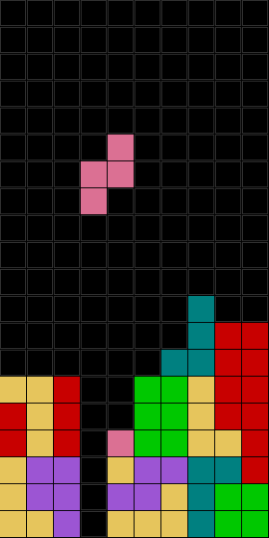
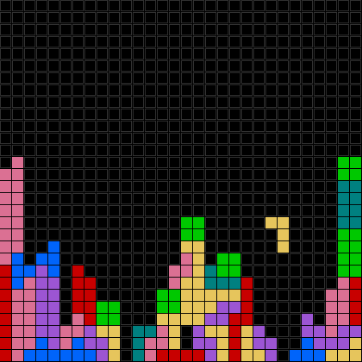

# Tetris
A simple tetris clone in C and SDL2 renderer

## Controls:
* arrow keys: movement, up: rotate
* shift + left/right/down: hard left/right/drop 
* spacebar: hard drop
* +/-: change speed
* p: pause
* Enter: restart
* Esc: quit

For custom size:

`./tetris 30 30 15` 
for 30x30 board with 15x15 pixel squares, ie:

